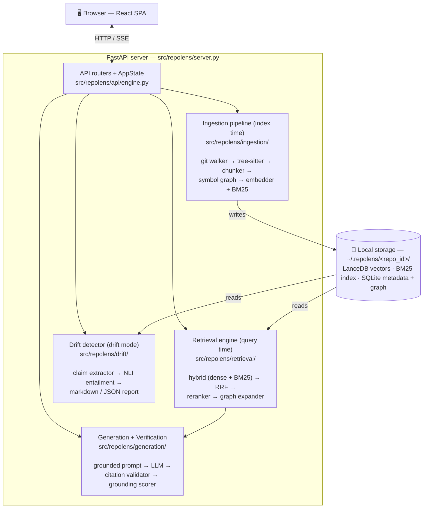

# RepoLens — The Complete Guide

> A single document that explains everything about RepoLens, starting from absolute zero.
>
> This is written so that **someone who has never seen the code — and who does not even know what
> RAG is** — can read it top to bottom and walk away understanding the problem, every technology
> choice, the full architecture, every important design decision, and be ready to defend all of it
> in an interview.
>
> It is deliberately long. Read it in order the first time. Use the table of contents to jump
> around afterwards.

---

## Table of Contents

**Part I — Foundations (assume you know nothing)**
1. What is a Large Language Model, and why does it "lie"?
2. The hallucination problem in plain English
3. What is RAG (Retrieval-Augmented Generation)?
4. How traditional RAG works, step by step
5. Embeddings and vector search, explained without math
6. Where traditional RAG falls short — especially on code

**Part II — What RepoLens Is**
7. The problem RepoLens solves
8. The three pillars
9. The key invariants (the promises the system makes)

**Part III — The Technology Stack (every choice justified)**
10. Backend language and tooling
11. The ML/NLP models
12. Storage technologies
13. Web and frontend stack

**Part IV — Architecture Deep Dive (grounded in the actual code)**
14. The big picture
15. Configuration system
16. Ingestion pipeline (index time)
17. Storage layer
18. Retrieval engine (query time)
19. Generation and verification
20. Drift detection
21. The API server, CLI, and frontend

**Part V — End-to-End Walkthroughs**
22. Indexing a repository
23. Asking a question
24. Running a drift check

**Part VI — Design Decisions and Trade-offs**

**Part VII — Interview Questions (with answers)**

---

# Part I — Foundations

This part assumes **zero** background. If you already know what RAG and embeddings are, skip to
Part II. But the interview questions at the end draw heavily on these fundamentals, so it is worth
at least skimming.

## 1. What is a Large Language Model, and why does it "lie"?

A **Large Language Model (LLM)** — like Claude, GPT-4, or Llama — is a very large neural network
trained on an enormous amount of text (books, websites, source code, documentation). Its single
core skill is deceptively simple: **given some text, predict what text comes next.**

That's it. When you "chat" with an LLM, under the hood it is repeatedly predicting the next most
likely word (technically, the next *token* — a token is roughly a word or word-fragment), one
token at a time, based on everything written so far.

Because it has read so much, this next-token prediction is astonishingly good. It can write code,
summarize articles, explain concepts, and hold a conversation. The knowledge it picked up during
training is baked into its billions of internal numbers (called **parameters** or **weights**).
This baked-in knowledge is called **parametric memory** — knowledge stored *in the parameters*.

Here is the catch that motivates this entire project:

- An LLM's parametric memory is **frozen at training time.** If a model was trained on data up to
  early 2024, it knows nothing about a library released in 2025.
- An LLM's parametric memory is **lossy and blurry.** It does not store exact copies of what it
  read. It stores statistical patterns. So it might "remember" that a certain function exists, but
  get its arguments subtly wrong.
- An LLM has **no concept of "I don't know."** Because its only job is to produce the most
  plausible next token, when it doesn't actually know something, it produces the most
  *plausible-sounding* answer anyway — confidently and fluently. This is called **hallucination.**

## 2. The hallucination problem in plain English

Imagine you ask a brilliant but overconfident colleague: *"How does the authentication middleware
in our codebase handle expired tokens?"*

Your colleague has seen thousands of codebases. They have a strong intuition about how
authentication middleware *usually* works. So they answer fluently and in detail — but they are
describing how authentication *typically* works, not how **your** code actually works. They might
say "it returns a 401 and refreshes the token," when your code actually throws an exception and
logs the user out.

That is exactly what an LLM does. For a new contributor to an open-source project, this is
dangerous: the LLM sounds authoritative, the contributor trusts it, and they ship a change based
on a description of code that doesn't exist.

The core insight is: **for questions about a specific, current codebase, the LLM's parametric
memory is the wrong source of truth. The right source of truth is the actual checked-out code.**

## 3. What is RAG (Retrieval-Augmented Generation)?

**RAG** stands for **Retrieval-Augmented Generation.** It is the standard technique for fixing the
two problems above (frozen knowledge + hallucination).

The idea is simple and powerful:

> Instead of asking the LLM to answer from its memory, first **retrieve** the relevant real
> documents, **paste them into the prompt**, and ask the LLM to answer **only using those
> documents.**

The name breaks down literally:
- **Retrieval** — find the relevant source material.
- **Augmented** — add (augment) that material to the prompt.
- **Generation** — the LLM generates an answer grounded in that material.

Think of it as turning a closed-book exam (answer from memory) into an open-book exam (answer using
the pages in front of you). The LLM is still the one writing the answer, but now it has the actual
facts on the desk, so it doesn't need to guess.

## 4. How traditional RAG works, step by step

Here is the classic ("vanilla") RAG pipeline. Almost every RAG tutorial describes this. RepoLens
starts from this and then improves on it (Parts IV onward).

**Phase A — Indexing (done once, ahead of time):**

1. **Collect documents.** Gather all the source material — PDFs, web pages, wiki articles,
   whatever your knowledge base is.
2. **Chunk them.** Documents are too big to fit in a prompt and too coarse to retrieve precisely.
   So you split each document into smaller pieces ("chunks") — for example, every 500 words, or
   every paragraph. Traditional RAG usually chunks by a **fixed character/token count** with some
   overlap between chunks.
3. **Embed each chunk.** Convert each chunk of text into a list of numbers (a **vector**) that
   captures its meaning. (See section 5 for what "embedding" means.)
4. **Store the vectors** in a **vector database**, which is built to find "nearest" vectors
   quickly.

**Phase B — Querying (done every time a user asks something):**

5. **Embed the question** using the same embedding model.
6. **Search** the vector database for the chunks whose vectors are closest to the question's
   vector. "Closest" means "most similar in meaning." This returns the top-K chunks (e.g. top 5).
7. **Build a prompt** that contains those chunks plus the user's question, with an instruction
   like "Answer the question using only the context below."
8. **Send to the LLM** and return its answer.

That's traditional RAG. It is a huge improvement over asking the LLM cold.

## 5. Embeddings and vector search, explained without math

Step 3 above mentioned "embedding." This is the heart of how a computer finds *meaning-similar*
text. Here is the intuition with no math.

An **embedding model** is a neural network that reads a piece of text and outputs a fixed-length
list of numbers — say 768 numbers. That list is called an **embedding** or a **vector.** You can
think of those 768 numbers as **coordinates of a point in a 768-dimensional space.**

The magic property: the model is trained so that **texts with similar meaning land close together
in that space**, and texts with different meanings land far apart. So "how do I log in" and "user
authentication flow" end up as nearby points, even though they share no words.

We can't picture 768 dimensions, but the 2D analogy is perfect: imagine a map where every sentence
is a pin. Sentences about cooking cluster in one corner; sentences about taxes cluster in another.
To find text similar to your question, you drop a pin for the question and look for the nearest
existing pins. That "nearest pins" lookup is **vector search** (also called **nearest-neighbour**
or **ANN** search — Approximate Nearest Neighbour, "approximate" because exact search is slow at
scale so we accept tiny inaccuracy for huge speed).

The most common way to measure "closeness" is **cosine similarity** — essentially the angle
between two vectors. Small angle = very similar; large angle = unrelated. RepoLens uses cosine
similarity (see `src/repolens/storage/vector.py`).

**One vocabulary distinction that matters later:**
- A **bi-encoder** embeds the query and the document *separately* into vectors, then compares the
  vectors. Fast (you can pre-compute all document vectors), but it never lets the query and
  document "look at each other," so it can miss nuance.
- A **cross-encoder** takes the query and one document **together** as a single input and outputs a
  relevance score. Much more accurate, but much slower — you can't pre-compute, you must run the
  model fresh for every (query, document) pair. RepoLens uses both, at different stages, for
  exactly this reason (see the reranker, section 18).

## 6. Where traditional RAG falls short — especially on code

Traditional RAG is great for prose (support docs, articles). It struggles badly on **source code**,
and even on prose it has weaknesses RepoLens explicitly fixes. Understanding these weaknesses is
the whole reason RepoLens exists, so study this list — it is the source of most interview
questions.

**Weakness 1 — Naive chunking destroys code structure.**
Splitting code "every 500 tokens" will cut a function in half, separate a function from its
signature, or merge the end of one class with the start of another. The resulting chunks are
semantically broken. Code has structure (functions, classes, methods) that fixed-size chunking
ignores. → *RepoLens fixes this with tree-sitter semantic chunking (section 16).*

**Weakness 2 — Pure vector search misses exact identifiers.**
Embeddings capture *meaning*, but code is full of exact names: `handleRoute`, `MAX_RETRIES`,
`UserAuthError`. If you search for the exact symbol `parse_citations`, a meaning-based search might
return "conceptually similar" code that never mentions that symbol. Keyword search (the old-school
technique) would nail it. → *RepoLens fixes this with hybrid search: vectors **and** BM25 keyword
search, fused together (section 18).*

**Weakness 3 — The query/code vocabulary gap.**
A user asks in English ("how does authentication work") but the code is, well, code. The English
question and the code snippet live in *different regions* of embedding space, so vector search can
miss the right code. → *RepoLens fixes this with HyDE (section 18).*

**Weakness 4 — No relationship awareness.**
Code is a graph: function A calls function B which implements interface C. If the answer to a
question lives partly in the caller and partly in the callee, retrieving only the top text match
gives you half the story. → *RepoLens fixes this with a symbol graph and graph expansion
(sections 16 & 18).*

**Weakness 5 — Retrieval is "best effort," ranking is crude.**
Vector search returns *something* for every query, even when nothing is actually relevant, and its
ordering is rough. → *RepoLens fixes this with a cross-encoder reranker and a structured "not found"
path (section 18 & 19).*

**Weakness 6 (the big one) — Nothing verifies the answer.**
Vanilla RAG pastes context and trusts the LLM. But the LLM can still ignore the context, blend in
its own memory, or cite something that isn't there. Traditional RAG has **no mechanism to check
whether the answer is actually supported by the retrieved text.** → *This is RepoLens's signature
contribution: every citation is re-opened and verified, and every answer gets an entailment-based
grounding score (section 19).*

Keep these six weaknesses in mind. Everything in Part IV is, in some sense, a direct response to
one of them.

---

# Part II — What RepoLens Is

## 7. The problem RepoLens solves

New contributors to large open-source (OSS) projects hit a **cold-start wall**:

- The documentation is incomplete, or worse, **stale** — it describes how the code used to work.
- LLM assistants **hallucinate confidently** because they "remember" an older version of the
  project from training, or describe how such code *usually* works.
- There is no tool that answers *"how does X actually work **in this repo, at this exact
  commit**"* and backs it up with **verifiable evidence**.

RepoLens is a **local-first RAG engine** that answers questions about any repository using
**only the actual checked-out code**, with **file/line citations**, **zero reliance on the model's
prior knowledge**, and **automatic detection of where the docs have drifted from the code.**

"Local-first" means everything — the vectors, the keyword index, the symbol graph, the metadata —
lives on **your disk** in `~/.repolens/`. The only network calls are to the LLM API (and even those
can be eliminated by using a local Ollama model).

## 8. The three pillars

RepoLens is built on three pillars. Each one directly attacks a weakness of traditional RAG.

**Pillar 1 — Grounding enforcement.**
Every sentence in an answer must cite a `file:line-range` span. The pipeline **post-validates**
every citation by re-opening the file on disk and confirming the line range exists. If retrieval
turns up nothing relevant, the system says **"not found in this codebase"** instead of letting the
LLM fill from memory. A **grounding score** (computed by a Natural Language Inference model) is
attached to every answer and shown in the UI. This is the answer to Weakness 6.

**Pillar 2 — Code-native retrieval.**
Source files are parsed with **tree-sitter** into semantic units (functions, classes, structs).
Each chunk carries metadata: file path, symbol name, signature, docstring. A **symbol graph**
tracks caller/callee relationships so retrieval can expand to include related code. Retrieval is
**hybrid** (dense embeddings + BM25 keyword search, fused with RRF) and then **re-ranked** with a
cross-encoder. This is the answer to Weaknesses 1–5.

**Pillar 3 — Doc-drift detection.**
A separate mode indexes the documentation and the code separately. For each factual claim in the
docs ("the default timeout is 30s"), it retrieves the corresponding code and runs NLI entailment to
label the claim **supported / contradicted / not found.** The output is a markdown report of
suspected stale docs, with the doc location and code location side by side. It is CI-compatible:
a `--ci` flag exits non-zero when contradictions are found, so stale docs can fail a build.

## 9. The key invariants (the promises the system makes)

These are non-negotiable rules the codebase enforces. They are quoted in `CLAUDE.md` as
"Key Invariants — Never Violate," and they map directly onto the code in Part IV.

1. **Every answer sentence must cite a `file:line-range` span.** No uncited claims.
2. **The citation validator must re-open the file and verify the cited range.** A citation to a
   non-existent line range causes the answer to be rejected and regenerated (max 2 retries), not
   silently passed through.
3. **If retrieval returns no relevant chunks, return a structured "not found" response.** Never let
   the LLM fall back on parametric memory.
4. **The grounding score is computed for every answer before it is returned.** It is part of the
   answer contract, not optional metadata.
5. **All data is local** (`~/.repolens/`). The only network calls are LLM API calls.
6. **`.repolensignore` patterns are applied before any file is parsed** (so `node_modules/`,
   `vendor/`, generated files, etc. never enter the index).
7. **`repolens serve` runs a single process on a single port** that serves both the API and the
   built React frontend from `src/repolens/static/`.

If you remember nothing else, remember invariants 2, 3, and 4 — they are what make RepoLens
trustworthy rather than just another RAG demo.

---

# Part III — The Technology Stack (every choice justified)

Every dependency here was chosen deliberately. This section explains *what* each one is, *why* it
was picked, and *what the alternatives were.* (Full rationale lives in `docs/TECHSTACK.md`.)

## 10. Backend language and tooling

**Python 3.11+** — The entire ML/NLP ecosystem (sentence-transformers, LanceDB, tree-sitter
bindings, FastAPI) is Python-first. Choosing anything else would mean writing foreign-function
wrappers or giving up the best tools. 3.11 specifically gives us `tomllib` in the standard library
(used to read `.repolens.toml`), structural pattern matching, and real speed gains over 3.10.

**uv** — A modern, Rust-based Python package manager, 10–100× faster than pip, with a lockfile
(`uv.lock`) for reproducible installs. Drop-in replacement; `uv sync` installs everything.

**hatchling** — The PEP 517 build backend. It natively supports the `src/` layout (see below) and
needs almost no configuration. Declared in `pyproject.toml` under `[build-system]`.

**The `src/` layout** — The package lives at `src/repolens/` rather than `repolens/` at the repo
root. This is a deliberate testing-hygiene choice: it prevents Python from accidentally importing
the package straight from the working directory. Tests then run against the *installed* package
(via `pip install -e .` / `uv sync`), which is what real users get — catching packaging bugs early.

**FastAPI + uvicorn[standard]** — The web framework. Chosen for native **async** support (essential
for streaming without blocking), automatic OpenAPI docs at `/docs`, `BackgroundTasks` for running
indexing without blocking the HTTP response, and tight Pydantic integration for request/response
validation.

**sse-starlette** — Provides `EventSourceResponse`, a clean way to stream **Server-Sent Events**
from FastAPI. It handles keep-alive, client-disconnect detection, and event formatting. (Why SSE
and not WebSockets? See section 21 and the interview questions.)

**typer + rich** — The CLI. `typer` builds a type-annotated CLI with automatic `--help`; `rich`
gives coloured output, progress bars, and tables. Crucially, the CLI is a *thin wrapper* over the
exact same engine code the server uses (`src/repolens/api/engine.py`), so behaviour is identical
between `repolens ask` in the terminal and the web chat.

**pydantic-settings** — Loads configuration from three layers with a clear precedence (env vars >
`.env` file > `.repolens.toml`), all typed and validated. See section 15.

**GitPython** — Git operations: discovering files, reading the current commit SHA, computing an
incremental diff between two commits, and cloning remote repos. (`pygit2` was considered but
GitPython is simpler and sufficient.)

## 11. The ML/NLP models

There are **four** models in RepoLens. Three run locally on your CPU; one is the LLM (remote by
default, optionally local). Knowing the role of each is essential.

**(a) tree-sitter — the parser (not an ML model, but the foundation of retrieval quality).**
tree-sitter is the industry-standard code parser. It turns source code into a **concrete syntax
tree** — a precise structural representation — for 100+ languages, each via a small grammar package.
RepoLens ships grammars for Python, Go, JavaScript, TypeScript, Rust, C, C++, and Java. We use it
to extract *exactly* the node types we want (function definitions, class definitions, etc.) with
correct start/end line positions. **Why not regex?** Regex shatters on multi-line strings, nested
braces, and language quirks. tree-sitter gives a real AST, so chunk boundaries land on real
syntactic boundaries.

**(b) jinaai/jina-embeddings-v2-base-code — the embedding model (Pillar 2).**
This turns each code chunk and each query into a 768-dimensional vector. It was chosen over
general-purpose embedders because it is:
- **Code-aware** — trained on code *and* natural language, so it understands symbol names, API
  calls, and type signatures.
- **8192-token context** — it can embed a 200-line function without truncation (most models cap at
  512 tokens).
- **768 dimensions** — compact enough for fast search, expressive enough for high recall.
- **Free and local** — runs on CPU, no per-chunk API cost.
Alternatives rejected: OpenAI `text-embedding-3-small` (per-chunk API cost at index time),
`bge-small` (not code-aware), `graphcodebert` (only 512 tokens).

**(c) cross-encoder/ms-marco-MiniLM-L-6-v2 — the reranker (Pillar 2).**
A **cross-encoder** that scores a (query, code-chunk) pair *jointly*. It is far more accurate at
relevance than the bi-encoder embedding model, but slower — so it is used only on the small set of
candidates that survive the first retrieval stage. ~22M parameters; fast on CPU.

**(d) cross-encoder/nli-deberta-v3-small — the grounding scorer and drift checker (Pillars 1 & 3).**
This is an **NLI** (Natural Language Inference) model. Given a *premise* and a *hypothesis*, it
outputs probabilities for three labels: **entailment** (the premise supports the hypothesis),
**contradiction** (the premise refutes it), or **neutral** (unrelated). RepoLens uses it two ways:
- **Grounding scoring**: premise = the cited code chunk, hypothesis = the answer sentence. High
  entailment → the answer really follows from the code.
- **Drift checking**: premise = retrieved code, hypothesis = the doc's claim. Entailment →
  supported; contradiction → contradicted; neutral → not found.
~44M parameters, runs in <100ms per pair on CPU.

**(e) The LLM — the generator.**
Pluggable backends behind a single interface (`BaseLLMClient`). The **default is Groq** (a free,
OpenAI-compatible hosted tier, using `llama-3.3-70b-versatile`) so the tool works out of the box
without a paid key. Alternatives: **Anthropic Claude**, **OpenAI**, and **Ollama** (fully local,
fully offline). Note: the original design defaulted to Anthropic Claude; the project later switched
the default to Groq to honour a "free APIs only" constraint. The LLM is used in three places: HyDE
query expansion, the final answer generation, and drift claim extraction.

## 12. Storage technologies

**LanceDB — the vector store.** Embedded (no server process to run), columnar (efficient for batch
writes at index time), persistent (survives restarts with zero config), and supports vector search
with metadata filters in one call. For a tool a developer runs on their laptop, *embedded* is the
right call. Alternatives: ChromaDB (simpler but slower at scale), Qdrant (great but needs a server),
FAISS (fast but not persistent, no metadata).

**rank_bm25 — the keyword index.** A pure-Python implementation of **BM25**, the classic keyword
ranking algorithm (it scores documents by term frequency, adjusted for how rare each term is and
how long the document is). Zero dependencies; fast enough for mid-size repos. Upgrade path if needed:
`tantivy-py` (Rust, ~100× faster). BM25 is what gives RepoLens its exact-identifier matching
(Weakness 2).

**NetworkX — the symbol graph.** An in-memory directed graph (`DiGraph`) of caller→callee, import,
and implementation edges. Stored in SQLite as an adjacency list and loaded into NetworkX for
traversal. NetworkX is mild overkill for 1-hop expansion, but it makes future features (cycle
detection, PageRank-based ranking) trivial.

**SQLite — the metadata store.** Standard-library, zero-config relational store. Holds the `repos`
and `files` tables (indexing state, commit SHA for incremental re-indexing, repo list for the UI)
and the serialized symbol-graph edges.

## 13. Web and frontend stack

**React 18 + TypeScript** — Industry standard. TypeScript makes the API contract between frontend
and backend type-safe.

**Vite** — Fast dev server with hot-module reload. Its config proxies all `/api/*` calls to
`localhost:8000` in development so the frontend and backend feel like one origin.

**Tailwind CSS v3** — Utility-first CSS, configured with the custom "Observatory" palette (deep
space colours, glass-morphism surfaces, a purple-to-blue gradient — see `docs/UI_SPEC.md`).

**@tanstack/react-query v5** — Handles fetching, caching, and background refresh of server state
(repo list, drift reports), removing the need for Redux.

**react-router-dom v6** — Client-side routing between the three pages (Repo Manager, Chat, Drift
Report).

**EventSource (browser built-in)** — The native browser API for consuming SSE streams. The
`useSSE.ts` hook wraps it with TypeScript types and cleans up on unmount.

---

# Part IV — Architecture Deep Dive

This part walks through the system module by module, grounded in the **actual source files.** File
paths are real and clickable. The codebase was built in 10 sequential steps (see `docs/STEPS.md`);
the module groupings below mirror those steps.

## 14. The big picture



There are **three operational modes**, all sharing one storage layer:

| Mode | Trigger | Flow |
|---|---|---|
| **Index** | `repolens index <path>` or UI "Add Repo" | walk → parse → chunk → embed → store |
| **Ask** | `repolens ask "..."` or UI chat | retrieve → generate → verify → stream |
| **Drift** | `repolens drift` or UI "Run Drift Check" | docs vs code → entailment → report |

A central object, `AppState` (in `src/repolens/api/engine.py`), holds the config, the storage
handles, and the three heavy local models loaded **once** at process start. Both the web endpoints
and the CLI build an `AppState` and call the same orchestration functions (`answer_events`,
`run_drift`), which is how the CLI and server stay behaviourally identical.

## 15. Configuration system (`src/repolens/config.py`)

A single `Config` object is the source of truth for every tunable. It is a `pydantic-settings`
model, so every value is typed and validated. Resolution precedence, highest first:

1. Explicit constructor arguments (used in tests).
2. Environment variables and the `.env` file.
3. A `.repolens.toml` file (project-local, or `~/.repolens/config.toml` globally).
4. The defaults declared on the models.

The clever bit is `settings_customise_sources`, which inserts the TOML source *below* env/.env so
**environment variables always win over the file.** Config is split into typed sub-sections:
`IndexConfig`, `RetrievalConfig`, `GenerationConfig`, `DriftConfig`. Defaults worth memorising:
`max_chunk_tokens=512`, `top_k_dense=20`, `top_k_bm25=20`, `top_k_rerank=8`,
`graph_expansion_hops=1`, `max_retries=2`, `grounding_threshold=0.5`. The default backend is
`groq` with model `llama-3.3-70b-versatile`. `get_config()` is `lru_cache`d so files are read once
per process.

## 16. Ingestion pipeline (index time) — `src/repolens/ingestion/`

This is where a repository becomes a searchable index. It runs as a background task; progress
streams to the UI over SSE.

**walker.py — the git walker.** Uses GitPython to list the files in the repo. It reads the indexed
commit SHA from SQLite; on a re-index it computes `git diff --name-only <old_sha> HEAD` so only
**changed files** are reprocessed (incremental indexing). It applies `.repolensignore` patterns
(via `utils/ignore.py`) **before yielding any path** (Invariant 6), detects language by file
extension, and yields `(file_path, language, content)`. Unsupported extensions are skipped silently.

**parser.py — the tree-sitter parser.** Loads the right grammar per language and walks the AST to
extract **semantic units**: functions/methods (signature + docstring + body), classes/structs/
interfaces, and documented top-level variables. It returns `ParsedChunk` objects carrying
`file_path, symbol_name, symbol_type, signature, docstring, body, start_line, end_line, language`.
This is the answer to Weakness 1: chunk boundaries are *syntactic*, not arbitrary.

**chunker.py — the semantic chunker.** Converts `ParsedChunk` → `IndexChunk` (the final unit that
gets embedded). Most symbols pass through unchanged. The interesting logic is for **oversized**
functions/classes: it sub-chunks them with a sliding window (default `max_tokens=512`,
`overlap_tokens=64`), but — and this is the careful part — it only splits on **bracket-balanced
line boundaries** (`_safe_boundaries`), so a chunk never begins or ends inside a nested block. Tiny
chunks (below `min_tokens`) are dropped as noise. Two details worth knowing:
- **Deterministic chunk IDs** (`make_chunk_id`) are derived from `file_path | symbol | part |
  sha256(body)`. Re-indexing unchanged code yields the *same* ID, so the vector-store upsert updates
  in place instead of creating duplicates.
- **Approximate token counting** uses a regex tokenizer, not the real model tokenizer — keeping the
  chunker fast and free of the heavy embedding dependency, while making consistent size decisions.

**graph.py — the symbol-graph builder.** Walks the chunks and uses tree-sitter to find function
*call* nodes (and import/implements relationships), producing a NetworkX `DiGraph` whose nodes are
chunk IDs and whose edges are labelled `calls`/`imports`/`implements`. This is what enables graph
expansion at query time (Weakness 4).

**embedder.py — the code embedder.** Loads `jina-embeddings-v2-base-code` via sentence-transformers
and embeds each chunk's `signature + docstring + body` in batches. It checks a **disk cache** keyed
by `sha256(content + model_name)` first — unchanged chunks are never re-embedded, which makes
re-indexing cheap. Output: a `(n_chunks, 768)` array.

**bm25.py — the BM25 indexer.** Tokenises each chunk with a **CamelCase-aware** tokenizer (so
`handleRoute` becomes `["handle", "Route"]` — critical for matching identifiers), builds a
`BM25Okapi` index, and serialises it to disk alongside the chunk IDs. This is the keyword half of
hybrid search.

## 17. Storage layer — `src/repolens/storage/`

Everything is stored under `~/.repolens/<repo_id>/` (Invariant 5).

**vector.py — LanceDB.** One table per repo (`chunks`) with schema `chunk_id, file_path,
symbol_name, symbol_type, language, start_line, end_line, embedding (float32), body_preview`.
Supports cosine ANN search with a `top_k` filter and `get_by_ids` lookups.

**metadata.py — SQLite.** The `repos` table (`id, name, url, local_path, indexed_commit_sha,
indexed_at, status, chunk_count`) and the `files` table track indexing state, power incremental
re-indexing, and feed the repo list in the UI.

**graph.py — graph store.** Serialises the NetworkX graph to a SQLite `graph_edges` adjacency list
and reloads it on demand; `get_neighbours(chunk_id, hops=1)` is what the expander calls.

**pipeline.py — `IndexingPipeline`.** The conductor that runs walker → parser → chunker → graph →
embedder → BM25 → storage in order. This is what `AppState.pipeline` points at.

## 18. Retrieval engine (query time) — `src/repolens/retrieval/`

Given a question, this produces the most relevant code chunks. It is a **funnel**: cast a wide net
cheaply, then narrow with progressively more expensive, more accurate stages.

**Stage 1 — hybrid.py: HyDE + dense + BM25, fused with RRF.**

First, **HyDE** (Hypothetical Document Embeddings) addresses Weakness 3. A natural-language
question and a code snippet live in different regions of embedding space. So instead of embedding
the bare question, RepoLens asks the LLM to *write a short, plausible code snippet that would answer
the question* and embeds **that** (concatenated with the query). The hypothetical code lands much
nearer to real code in vector space, dramatically improving recall. If no LLM client is supplied,
or HyDE generation fails, it gracefully falls back to embedding the raw query (`_hyde` returns `""`).

Then it runs **two searches in parallel** (`asyncio.gather`): dense ANN over LanceDB (top-20) and
BM25 keyword search (top-20). The two ranked lists are merged with **Reciprocal Rank Fusion (RRF)**:

```
RRF_score(chunk) = Σ over each list of  1 / (k + rank_in_that_list)      with k = 60
```

Why RRF and not just adding the scores? Because dense cosine scores and BM25 scores are on totally
different, incomparable scales. RRF ignores the *magnitudes* and uses only the *ranks*, so a chunk
that ranks highly in **either** signal surfaces, and a chunk that ranks well in **both** gets the
biggest boost. This is the answer to Weakness 2 — semantic recall and exact-keyword precision in
one ranked list. Returns the top-20 fused candidates.

**Stage 2 — reranker.py: cross-encoder.** The top-20 candidates are re-scored with
`ms-marco-MiniLM-L-6-v2`, a cross-encoder that reads each (query, chunk) pair *together* and so
judges relevance much more precisely than the bi-encoder embeddings could. Returns the top-8. This
is the accuracy stage; it runs on a small set precisely because cross-encoders are slow.

**Stage 3 — expander.py: graph expansion.** For each of the 8 reranked chunks, it looks up the
symbol in the NetworkX graph and pulls in **1-hop neighbours** (immediate callers and callees),
fetches those chunks from LanceDB, deduplicates, and caps the total at ~12 chunks. This is the
answer to Weakness 4: if the answer spans a caller and its callee, both are now in context.

The result — roughly 12 highly relevant, structurally complete chunks — is handed to generation.

## 19. Generation and verification — `src/repolens/generation/`

This is where RepoLens earns its trustworthiness. The orchestration lives in
`answer_events()` in `src/repolens/api/engine.py`; the building blocks live here.

**prompt.py — the grounded prompt.** The system prompt is the grounding contract turned into
rules. It tells the model: use **ONLY** the provided excerpts; **never** use prior knowledge;
**every sentence must end with a `[path:start-end]` citation copied exactly from the excerpt
headers**; and if the excerpts can't answer the question, reply with the single exact line
`NOT_FOUND_IN_CODEBASE` (the `NOT_FOUND_MARKER`) and nothing else. `build_user_message` lays out
each retrieved chunk *with its exact citable span in the header* — which is precisely what lets the
validator later re-open and check each span.

**llm/ — the backends.** `base.py` defines `BaseLLMClient`, an abstract class with one required
async method, `stream(messages, system) -> AsyncIterator[str]`, plus a `complete()` helper that
joins the stream into a string. Concrete implementations: `GroqClient` (default), `AnthropicClient`,
`OpenAIClient`, `OllamaClient`. The rest of the system depends only on this one streaming
interface, never on a specific SDK — that is the Strategy pattern, and it is why swapping LLMs is a
config change.

**validator.py — the citation validator (Invariant 2).** After the LLM produces an answer,
`parse_citations` extracts every `[file:start-end]` span via regex. For each one, `CitationValidator`:
1. Re-opens the file on disk (`_read_lines`).
2. Checks the range actually exists: `1 <= start <= end <= number_of_lines` (`_range_ok`).
3. For surviving citations, computes a cheap **Jaccard token similarity** between the cited code
   and the sentence that cited it — a soft signal to surface weak (valid-but-irrelevant) citations.

If **any** citation is invalid (file missing or line range out of bounds), the answer is rejected.

**The retry loop** (in `answer_events`) is where invariants 1–3 come alive. Notice the critical
design choice: **generation is fully buffered and validated *before a single token is streamed to
the user*.** The loop calls `llm.complete(...)` (not the streaming UI path), checks for the
not-found marker, then validates. If validation fails, it regenerates — up to `max_retries + 1`
attempts (default 3 total). Only once an answer passes validation are its tokens replayed to the
browser as `token` events, followed by `citation` events, then the grounding event, then `done`.
If all retries fail, it emits a structured `error` event with `type: "validation_failed"`. If
retrieval found nothing, it emits `type: "not_found"` and never calls the LLM at all (Invariant 3).

**scorer.py — the NLI grounding scorer (Invariant 4).** A valid citation (the span exists) does not
guarantee the sentence actually *follows from* that span. So `GroundingScorer` measures real
entailment: each answer sentence (the hypothesis) is run through `nli-deberta-v3-small` against its
cited code (the premise). Per sentence it takes the **max** entailment probability over the cited
chunks; the answer's score is the **mean** across sentences. A crucial implementation detail:
`apply_softmax=True` is passed to the cross-encoder, because by default it returns raw logits that
can fall outside [0,1] and produce nonsensical scores above 1.0 — softmax over the three NLI labels
turns them into genuine probabilities. The score maps to a verdict: `high ≥ 0.75`, `medium ≥ 0.5`,
`low ≥ 0.25`, else `none`. This score is streamed as the final event before `done`.

So the answer contract delivered to the browser is: validated citations + a calibrated grounding
score + a clean not-found/error path. That is the whole point of the project.

## 20. Drift detection — `src/repolens/drift/`

Drift mode reuses the retrieval and NLI machinery to find stale docs (Pillar 3).

**extractor.py — `ClaimExtractor`.** Indexes the docs separately (README, `/docs/**/*.md`,
docstrings, inline comments) and uses the LLM to pull out discrete factual claims in structured
form: `DocClaim{claim, doc_file, doc_line}` — e.g. `{"claim": "the default timeout is 30s",
"doc_file": "README.md", "doc_line": 42}`.

**checker.py — `DriftChecker`.** For each claim it runs the **exact same Step-6 hybrid retriever** a
user question would use, so the claim is checked against the same code a question would surface.
Then, for the retrieved chunks, it uses `GroundingScorer.classify` (the three-way NLI verdict) to
find the chunk with the highest entailment and the chunk with the highest contradiction. The
decision logic:
- best entailment ≥ `support_threshold` → **supported**
- else best contradiction ≥ `contradict_threshold` → **contradicted**
- else → **not_found**
If retrieval returns nothing, it is immediately **not_found**. Each result is a `DriftFinding`
pairing the doc location with the matched code location, the verdict, and a code excerpt.

**reporter.py — `DriftReporter`.** Collects all findings into a markdown report (Contradicted /
Not Found / Supported sections, with doc location and code location side by side) via `to_markdown`,
plus `to_json` for the UI. `has_contradictions()` powers the **`--ci` flag**: if any contradictions
exist, the CLI exits non-zero, so stale docs can fail a CI build.

## 21. The API server, CLI, and frontend

**server.py — `create_app()`.** A FastAPI factory that mounts the routers under `/api/`, serves the
built React app from `src/repolens/static/` at `/` (Invariant 7), and adds CORS for local dev
(`localhost:5173` ↔ `localhost:8000`). One process, one port.

**api/ — the routers.**
- `repos.py` — `POST /api/repos` (add a repo, kicks off background indexing), `GET /api/repos`,
  `GET /api/repos/{id}`, `DELETE /api/repos/{id}`, and `GET /api/repos/{id}/index` (SSE indexing
  progress).
- `ask.py` — `POST /api/repos/{id}/ask`, an SSE endpoint that drives `answer_events` and streams
  `token` → `citation` → `grounding` → `done` (or `error`).
- `drift.py` — `POST /api/repos/{id}/drift`, `GET /api/repos/{id}/drift/latest`,
  `GET /api/repos/{id}/drift/stream` (SSE progress).
- `engine.py` — the shared orchestration described in sections 14, 18, 19, 20.
- `deps.py` — dependency-injection wiring for FastAPI.

**Why SSE rather than WebSockets?** The data flow is purely one-directional (server → client) once
a request starts — that exactly matches answer streaming. SSE is simpler than WebSockets (no
handshake, no keep-alive bookkeeping), works through proxies and firewalls unmodified, and is
natively supported by browsers via `EventSource`. WebSockets' bidirectionality would be unused
complexity.

**cli.py — typer commands.** `repolens index <path>`, `repolens ask <query> --repo <id>`,
`repolens drift --repo <id> [--ci]`, and `repolens serve [--host] [--port]`. Each is a thin wrapper
over the same engine the server uses.

**frontend/ — the Observatory UI.** A React + TypeScript SPA with three pages — **Repo Manager**
(grid of repo cards, add-repo modal, live indexing progress), **Chat** (repo selector + streaming
answer with inline citation chips and an animated circular grounding ring), and **Drift Report**
(tabs for Contradicted / Not Found / Supported, with split doc-vs-code finding cards). `lib/api.ts`
holds typed fetch wrappers; `hooks/useSSE.ts` wraps `EventSource`; `hooks/useRepos.ts` wraps
react-query. The design follows `docs/UI_SPEC.md`: deep-space palette, glass-morphism, purple-to-blue
gradient. `scripts/build.sh` builds the frontend and copies `dist/` into `src/repolens/static/` so
the whole app ships as one Python package.

---

# Part V — End-to-End Walkthroughs

These tie the modules together into the three things a user actually does.

## 22. Indexing a repository

1. User adds a repo (UI "Add Repo" or `repolens index ./myrepo`). `POST /api/repos` writes a
   `repos` row with status `indexing` and launches a **background task**.
2. **walker.py** lists files, applies `.repolensignore`, detects languages, yields file contents.
3. **parser.py** turns each file into `ParsedChunk` semantic units via tree-sitter.
4. **chunker.py** turns those into `IndexChunk`s, sub-chunking oversized symbols on safe boundaries
   and assigning deterministic IDs.
5. **embedder.py** embeds chunks (skipping any already in the disk cache) → 768-d vectors.
6. **bm25.py** builds the keyword index; **graph.py** builds the symbol graph.
7. **storage/** writes vectors to LanceDB, the graph to SQLite, and metadata (commit SHA, chunk
   count, status → `ready`).
8. Throughout, progress streams to the UI as SSE `progress` events (`{file, done, total}`).

A later re-index only touches files changed since `indexed_commit_sha`, and unchanged chunks hit
the embedding cache — so re-indexing is fast.

## 23. Asking a question

1. UI/CLI hits `POST /api/repos/{id}/ask`; the server calls `answer_events(state, repo, query)`.
2. **Retrieval funnel**: HyDE expands the query → dense + BM25 in parallel → RRF fusion (top-20) →
   cross-encoder rerank (top-8) → graph expansion (≤12 chunks).
3. If no chunks came back → emit `error` with `type: "not_found"`; **the LLM is never called**
   (Invariant 3).
4. **Grounded prompt** is built with the chunks (each labelled with its citable span).
5. **Generate + validate loop** (up to 3 attempts): `llm.complete(...)` → if the answer is the
   `NOT_FOUND_MARKER`, emit not-found; otherwise parse citations and validate every span against
   disk. On failure, regenerate. Nothing is shown to the user until an answer passes.
6. **Stream**: the validated answer's tokens are replayed as `token` events, then `citation` events
   (with the matched symbol), then the **NLI grounding score** as a `grounding` event, then `done`.

## 24. Running a drift check

1. UI/CLI hits `POST /api/repos/{id}/drift` (or `repolens drift --repo <id> [--ci]`); the server
   calls `run_drift` / streams `drift_events`.
2. **ClaimExtractor** reads the docs and uses the LLM to extract `DocClaim`s.
3. For each claim, **DriftChecker** retrieves code with the same hybrid retriever and runs the
   three-way NLI classifier → labels it supported / contradicted / not_found.
4. **DriftReporter** assembles a markdown + JSON report, pairing each doc location with the matched
   code location.
5. With `--ci`, the CLI exits non-zero if any claim is **contradicted**, failing the build on stale
   docs.

---

# Part VI — Design Decisions and Trade-offs

A consolidated list of the "why" behind the big choices. Each one is a likely interview prompt.

- **Why a `src/` layout?** Forces tests to run against the installed package, catching packaging
  bugs; prevents accidental imports from the working directory.
- **Why LanceDB over Chroma/Qdrant/FAISS?** Embedded + persistent + columnar + metadata-aware, with
  no server to run — ideal for a local-first laptop tool.
- **Why hybrid (dense + BM25) instead of just vectors?** Vectors capture meaning but miss exact
  identifiers; BM25 nails exact symbols; fusing both covers each other's blind spots.
- **Why RRF for fusion?** Dense and BM25 scores are on incomparable scales; RRF fuses by *rank*, not
  magnitude, so neither signal needs normalising and agreement across signals is rewarded.
- **Why HyDE?** It closes the natural-language ↔ code vocabulary gap by embedding a hypothetical
  code answer instead of the raw English question.
- **Why a cross-encoder reranker after RRF?** Bi-encoders (embeddings) are fast but coarse;
  cross-encoders are accurate but slow. Use the fast one to get 20 candidates, the slow one to pick
  the best 8 — best of both.
- **Why a symbol graph and 1-hop expansion?** Code is a call graph; answers often span a caller and
  callee. 1 hop adds the missing context without exploding the prompt.
- **Why validate citations by re-opening files?** Instructions are not guarantees. The only way to
  be *sure* a citation is real is to check it against the actual file — this is the project's core
  trust mechanism (Invariant 2).
- **Why buffer-then-stream instead of streaming raw tokens?** You cannot un-show a hallucinated
  sentence. Buffering lets validation reject and regenerate a bad answer *before* the user ever
  sees it.
- **Why NLI for grounding instead of just citation existence?** A citation can point at a real span
  that doesn't actually support the sentence. NLI measures genuine entailment, giving a calibrated
  trust score with no task-specific fine-tuning.
- **Why SSE over WebSockets?** The stream is one-directional; SSE is simpler, proxy-friendly, and
  natively supported by browsers.
- **Why pluggable LLM backends behind one interface?** Strategy pattern — swapping Groq ↔ Anthropic
  ↔ OpenAI ↔ Ollama (local/offline) becomes a config change, and tests can inject fakes.
- **Why local models for embedding/rerank/NLI?** Cost (no per-chunk API fees), privacy (code never
  leaves the machine for these), and offline capability.
- **Why deterministic chunk IDs?** So re-indexing unchanged code upserts in place instead of
  duplicating rows, and so the embedding cache hits.
- **Why approximate token counting in the chunker?** To keep the chunker fast and free of the heavy
  tokenizer dependency, while still making consistent size decisions.

---

# Part VII — Interview Questions (with answers)

These are organised from fundamentals to deep system design. For each, a concise model answer is
given. Practise saying them aloud.

## A. Fundamentals (RAG, embeddings, LLMs)

**Q1. What is RAG and what problem does it solve?**
Retrieval-Augmented Generation. Instead of letting an LLM answer from its frozen, lossy parametric
memory (which causes hallucination and staleness), you first retrieve relevant real documents, put
them in the prompt, and instruct the model to answer only from them. It converts a closed-book exam
into an open-book one.

**Q2. Walk me through a traditional RAG pipeline.**
Index time: collect → chunk (usually fixed-size) → embed each chunk → store vectors. Query time:
embed the question → vector-search for nearest chunks → stuff top-K into a prompt → generate.

**Q3. What is an embedding?**
A fixed-length vector of numbers representing a text's meaning, produced by a neural network trained
so similar meanings land near each other in vector space. Similarity is usually measured by cosine
(angle between vectors).

**Q4. Bi-encoder vs cross-encoder?**
A bi-encoder embeds query and document separately, so document vectors can be precomputed — fast,
scalable, but never lets the two texts interact, so it's coarser. A cross-encoder feeds query and
document together and outputs a relevance score — far more accurate, but can't precompute, so it's
slow. RepoLens uses a bi-encoder for first-pass retrieval and a cross-encoder to rerank the
survivors.

**Q5. Why do LLMs hallucinate?**
Their objective is to produce the most plausible next token, not to be truthful or to abstain. With
no grounding, "plausible" and "correct" diverge, and the model has no built-in "I don't know."

**Q6. What are the main weaknesses of traditional RAG, especially for code?**
Naive fixed-size chunking breaks code structure; pure vector search misses exact identifiers; the
NL-question/code vocabulary gap hurts recall; no awareness of caller/callee relationships; crude
ranking with no "not found" path; and — the big one — no verification that the answer is actually
supported by the retrieved text. RepoLens addresses each.

## B. RepoLens-specific design

**Q7. What are RepoLens's three pillars?**
(1) Grounding enforcement — mandatory citations, validated by re-opening files, plus an NLI
grounding score and a structured not-found path. (2) Code-native retrieval — tree-sitter semantic
chunking, a symbol graph, hybrid dense+BM25 search with RRF, and a cross-encoder reranker.
(3) Doc-drift detection — extract doc claims and label them supported/contradicted/not_found via
NLI, CI-compatible.

**Q8. How does the retrieval funnel work and why is it staged?**
HyDE-expanded query → dense ANN (top-20) + BM25 (top-20) in parallel → RRF fusion (top-20) →
cross-encoder rerank (top-8) → graph expansion (≤12). It's staged so the cheap, high-recall stages
cast a wide net and the expensive, high-precision cross-encoder only runs on a small candidate set.

**Q9. Explain RRF and why you don't just sum the scores.**
Reciprocal Rank Fusion scores each item as Σ 1/(k+rank) across the ranked lists (k=60). Dense cosine
scores and BM25 scores are on different, incomparable scales, so summing them is meaningless. RRF
uses only ranks, so no normalisation is needed and items ranked well by either or both signals rise.

**Q10. What is HyDE and what problem does it solve?**
Hypothetical Document Embeddings. A natural-language question embeds far from code in vector space.
HyDE asks the LLM to draft a short hypothetical code snippet that would answer the question and
embeds that instead — landing the query vector much closer to real code, improving recall. RepoLens
falls back to the raw query if the LLM is unavailable or HyDE fails.

**Q11. How does citation validation work, and why is it essential?**
Every `[file:start-end]` citation is parsed out, the file is re-opened on disk, and the line range
is checked to actually exist (`1 ≤ start ≤ end ≤ line_count`). Any invalid citation rejects the
whole answer, which is regenerated (up to `max_retries`). Instructions to the LLM are not
guarantees; re-opening the file is the only way to *know* a citation is real (Invariant 2).

**Q12. Why buffer the full answer and validate before streaming any tokens to the user?**
Because you cannot retract a sentence the user has already seen. By generating fully and validating
first, a hallucinated or mis-cited answer is caught and regenerated before display — only a
validated answer is replayed token-by-token to the browser.

**Q13. What is the grounding score and how is it computed?**
A 0–1 measure of how well the answer is entailed by its cited code, from an NLI cross-encoder
(`nli-deberta-v3-small`). Each sentence is the hypothesis, its cited chunk(s) the premise; per
sentence we take the max entailment probability, and the answer score is the mean. `apply_softmax`
is required so the model's logits become real probabilities. Verdict bands: high ≥0.75, medium ≥0.5,
low ≥0.25, else none.

**Q14. Citation validation already checks the span exists — why also run NLI grounding?**
Existence ≠ support. A citation can point to a real, in-range span that doesn't actually back the
claim. NLI measures whether the sentence genuinely *follows from* the cited code, giving a
calibrated trust signal that a regex existence check cannot.

**Q15. What happens when retrieval finds nothing relevant?**
The system emits a structured `error` event with `type: "not_found"` and **never calls the LLM** —
preventing it from answering from parametric memory (Invariant 3). The model is also instructed to
emit `NOT_FOUND_IN_CODEBASE` if the provided excerpts can't answer, which triggers the same path.

**Q16. How does doc-drift detection work?**
Extract factual claims from docs (LLM) → for each claim, retrieve code with the same hybrid
retriever → run three-way NLI (entailment/contradiction/neutral) between code (premise) and claim
(hypothesis) → label supported/contradicted/not_found. The report pairs doc and code locations;
`--ci` exits non-zero on contradictions to fail a build on stale docs.

**Q17. Why is tree-sitter used instead of regex or fixed-size chunking?**
Regex breaks on multi-line strings, nested braces, and per-language quirks; fixed-size chunking cuts
functions in half. tree-sitter produces a real AST, so chunks align with actual functions/classes
and carry correct line numbers — which also makes citations meaningful.

**Q18. How does the chunker handle a function bigger than the token limit?**
It sub-chunks with a sliding window (max 512, overlap 64) but only splits on **bracket-balanced**
line boundaries, so a chunk never starts or ends inside a nested block. Sub-chunks below the minimum
token count are dropped, and each gets a deterministic ID.

**Q19. What's the role of the symbol graph?**
It records caller→callee, import, and implements edges. At query time, graph expansion pulls in the
1-hop neighbours of the top reranked chunks, so answers that span a caller and its callee have both
in context. Stored in SQLite, traversed via NetworkX.

**Q20. How are the LLM backends abstracted?**
Behind `BaseLLMClient`, an abstract class with one async `stream()` method (plus a `complete()`
helper). Groq/Anthropic/OpenAI/Ollama each implement it. The rest of the system depends only on the
interface (Strategy pattern), so switching providers is a config change and tests can inject fakes.

## C. Engineering and systems

**Q21. Why SSE instead of WebSockets?**
The stream is one-directional (server→client) once a request starts, which matches answer streaming
exactly. SSE is simpler (no handshake/keep-alive bookkeeping), passes through proxies/firewalls, and
is built into browsers via `EventSource`. WebSocket bidirectionality would be unused complexity.

**Q22. Why is the architecture "local-first," and what are the trade-offs?**
All indexes (vectors, BM25, graph, metadata) live on disk in `~/.repolens/`; only LLM calls hit the
network (and Ollama removes even those). Pros: privacy, no per-chunk API costs, offline capability,
zero infra to run. Trade-off: bound by laptop CPU/RAM, so the local models are deliberately small,
and very large repos may need the documented upgrade paths (e.g. tantivy for BM25).

**Q23. How does incremental re-indexing work?**
The indexed commit SHA is stored in SQLite. On re-index, `git diff --name-only <old_sha> HEAD` finds
changed files, so only those are reprocessed. Deterministic chunk IDs plus the content-hash
embedding cache mean unchanged chunks are neither re-embedded nor duplicated.

**Q24. How is configuration resolved?**
`pydantic-settings` with precedence: constructor args > env vars / `.env` > `.repolens.toml` >
defaults. A custom `settings_customise_sources` inserts the TOML source below env so env always
wins. Config is split into typed `index`/`retrieval`/`generation`/`drift` sections and cached with
`lru_cache`.

**Q25. Why do the CLI and the web server behave identically?**
Both construct an `AppState` (config + storage handles + the three heavy models loaded once) and
call the same orchestration functions (`answer_events`, `run_drift`) in `api/engine.py`. The route
handlers and CLI commands are thin shells over shared logic.

**Q26. How is the system tested without downloading the heavy models?**
The models are injectable. `build_state` accepts optional `embedder`/`reranker`/`scorer`/
`llm_factory`; the scorer and LLM clients take injected fakes. So unit/e2e tests drive the real
orchestration with lightweight stand-ins. Tests are split into unit (no external deps), integration
(needs local models), and e2e (full server via httpx).

**Q27. How does the app ship as a single process on one port?**
`scripts/build.sh` builds the React app and copies `frontend/dist/` into `src/repolens/static/`.
`create_app()` mounts that directory at `/` and the API under `/api/`. `repolens serve` runs one
uvicorn process on `localhost:8000` serving both (Invariant 7). It's also packaged as a wheel and a
multi-stage Docker image.

**Q28. What are the failure modes around the LLM and how are they handled?**
`friendly_llm_error` maps exceptions to user-facing `(message, type)` pairs: missing key →
`llm_unconfigured`, HTTP 429 / "rate limit" → `rate_limited`, otherwise → `llm_error`. These surface
as clean SSE `error` events instead of raw 500s with stack traces, and the UI can react to the type.

**Q29. Why default to Groq when the docs were written around Anthropic Claude?**
A project constraint to use only free APIs. Groq offers a free, OpenAI-compatible hosted tier, so it
became the default backend (`llama-3.3-70b-versatile`) for out-of-the-box use; Anthropic/OpenAI/
Ollama remain available via config. Local models (embeddings/reranker/NLI) were unaffected since
they already run locally for free.

**Q30. If you had to scale RepoLens to a 1M-file monorepo, what would you change?**
Swap `rank_bm25` for `tantivy-py` (Rust, ~100×); shard/partition LanceDB and consider an ANN index
build; parallelise ingestion across processes; persist the symbol graph more granularly and load it
lazily per subtree; batch embeddings on GPU; and possibly move the heavy models behind a small local
inference service so a `serve` process isn't holding all of them in RAM. The funnel architecture and
incremental indexing already help a great deal.

## D. Curveballs

**Q31. A user says the grounding score was once above 1.0. What was the bug?**
The NLI cross-encoder returns raw logits by default, which can exceed 1. The fix is
`apply_softmax=True` so the three NLI labels become genuine probabilities in [0,1]; the entailment
column is then a valid score. (This is documented inline in `scorer.py`.)

**Q32. The chunker once hung on a file. What edge case causes that and how is it guarded?**
A single line longer than `max_tokens`: the window spans just that line and the overlap back-off can
land on the same start, looping forever. The chunker guards this by guaranteeing forward
progress — if the computed overlap start doesn't advance past the current start, it drops the
overlap for that boundary and continues from `end`.

**Q33. Why not let the model stream tokens directly for a snappier UX?**
Because validation must happen first. A snappy stream of a wrong, mis-cited answer violates the
core promise. The compromise is buffer-validate-then-replay: the user still sees a token stream, but
only of an answer that already passed validation.

**Q34. Could RepoLens answer a question with zero citations?**
No. `parse_citations` returning empty makes the validator fail with "Answer contains no citations,"
which triggers regeneration; if every attempt still has no citations, it returns a
`validation_failed` error rather than an uncited answer (Invariant 1).

**Q35. Where could RepoLens still hallucinate, and how is the risk bounded?**
Within a *single* cited chunk the model could mis-summarise while still citing a real, in-range span.
Citation validation won't catch that (the span exists), but the **NLI grounding score** is exactly
the backstop: a low entailment score flags that the sentence doesn't follow from its cited code, and
the score is shown to the user on every answer. Residual risk is surfaced, not hidden.

---

## Appendix — Where to look in the code

| Concern | File |
|---|---|
| Config & precedence | `src/repolens/config.py` |
| Orchestration (ask/drift), `AppState` | `src/repolens/api/engine.py` |
| Git walking & ignore | `src/repolens/ingestion/walker.py`, `src/repolens/utils/ignore.py` |
| tree-sitter parsing | `src/repolens/ingestion/parser.py` |
| Semantic chunking | `src/repolens/ingestion/chunker.py` |
| Embeddings (+ cache) | `src/repolens/ingestion/embedder.py`, `src/repolens/utils/cache.py` |
| BM25 | `src/repolens/ingestion/bm25.py` |
| Symbol graph build | `src/repolens/ingestion/graph.py` |
| LanceDB / SQLite / graph store | `src/repolens/storage/{vector,metadata,graph}.py` |
| Indexing pipeline | `src/repolens/storage/pipeline.py` |
| Hybrid retrieval (HyDE + RRF) | `src/repolens/retrieval/hybrid.py` |
| Reranker | `src/repolens/retrieval/reranker.py` |
| Graph expansion | `src/repolens/retrieval/expander.py` |
| Grounded prompt | `src/repolens/generation/prompt.py` |
| LLM backends | `src/repolens/generation/llm/*.py` |
| Citation validator | `src/repolens/generation/validator.py` |
| Grounding scorer (NLI) | `src/repolens/generation/scorer.py` |
| Drift extract/check/report | `src/repolens/drift/{extractor,checker,reporter}.py` |
| Server, routers, CLI | `src/repolens/server.py`, `src/repolens/api/*.py`, `src/repolens/cli.py` |
| Frontend | `frontend/src/**` |

---

*This guide reflects the implementation as of the current `main` branch. When the code changes,
update this document — especially the invariants, the default LLM backend, and the retrieval
parameters, which are the parts most likely to drift.*
